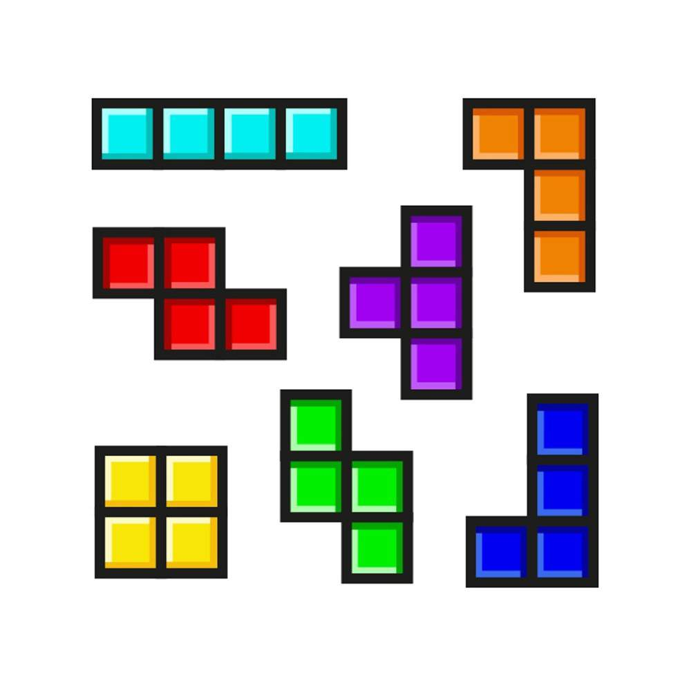

University of Tartu, Institute of Technology
LTTI.00.019
2018/2019 Spring

# Digital Image Processing: Detection of Tetris-like shapes

## Problem

To develop a software that will detect shapes and colors of Tetris blocks in an image.

## Sample Image

Sample test image for shapes and color detection:

